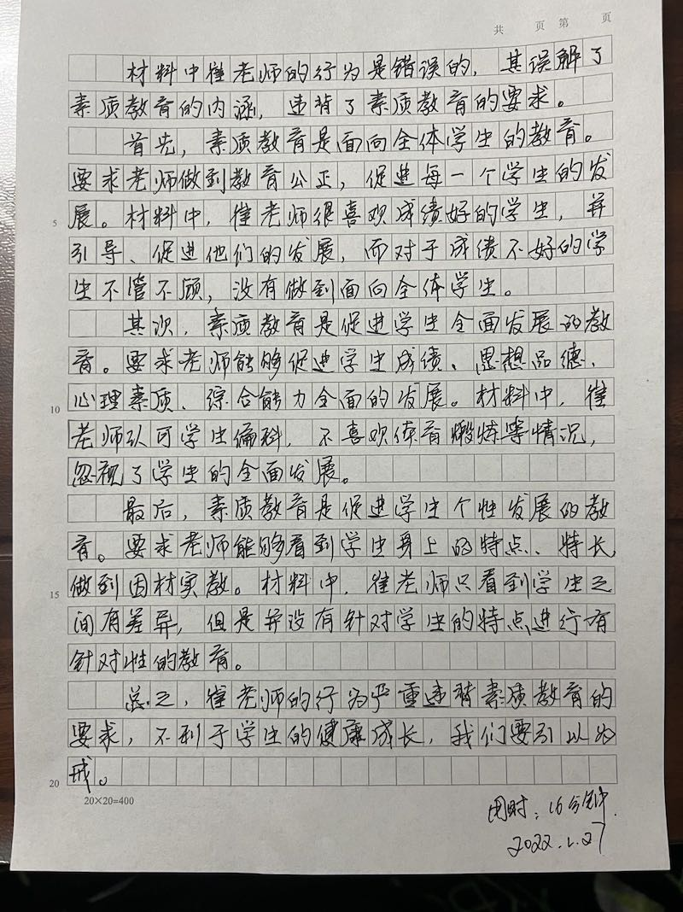
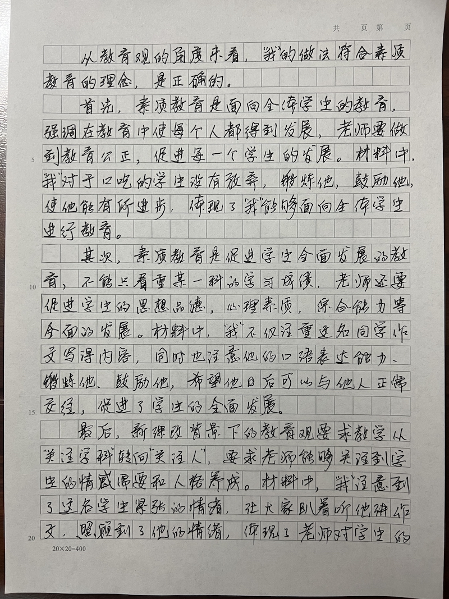
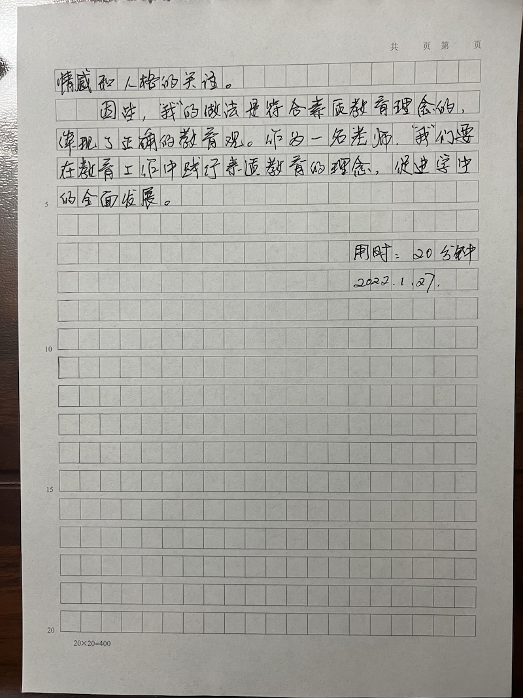
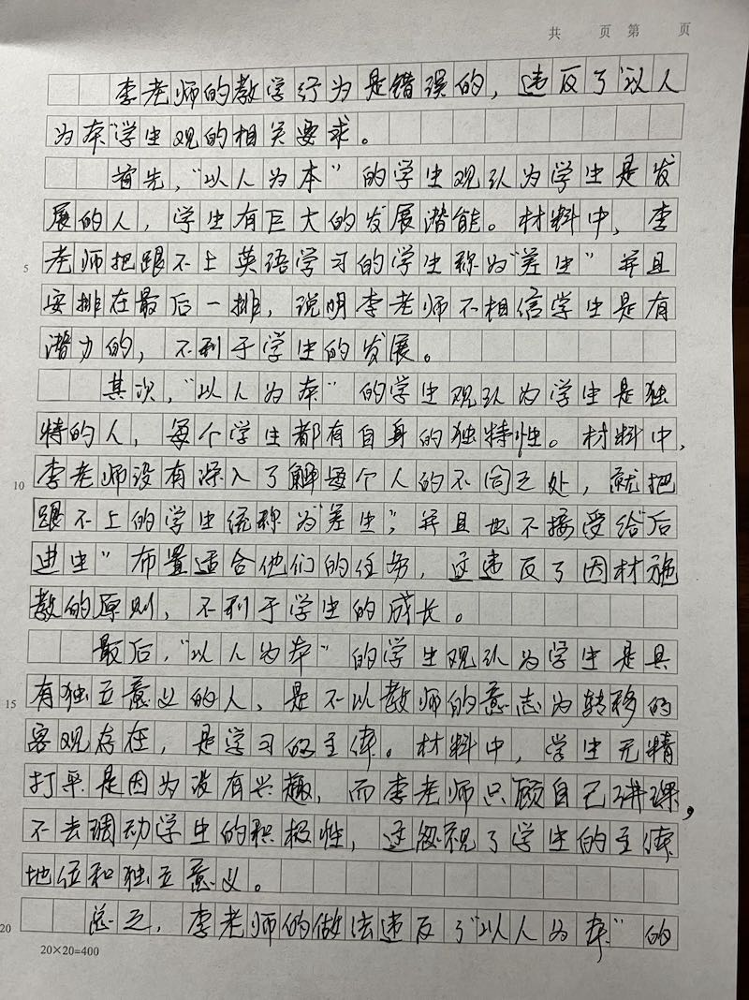
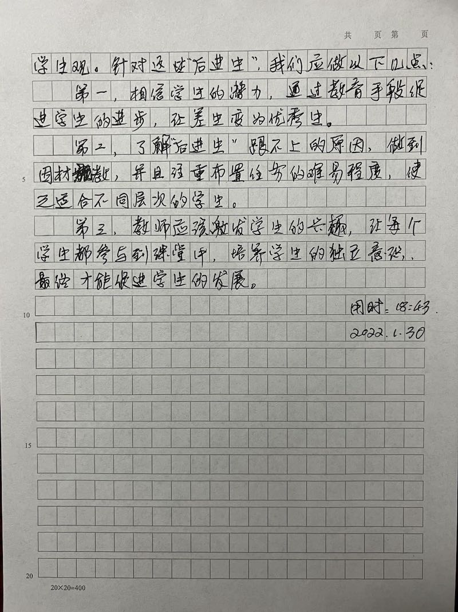

历年题型分布：

1. 单选题：4（**教师观**有 1 题较难）
2. 材料分析题：1

## 一、教育观

### 1.1 教育观总览

1. 素质教育的内涵
   1. 素质教育以提高**国民素质**为根本宗旨
   2. 素质教育是面向**全体学生**的教育
   3. 素质教育是促进学生**全面发展**的教育
   4. 素质教育是促进学生**个性发展**的教育
   5. 素质教育是以培养学生的**创新**精神和**实践**能力为重点的教育
2. 新课程改革的教学观
   1. 教学从“以教育者为中心”转向“**以学习者为中心**”
   2. 教学从“教会学生知识”转向“**教会学生学习**”
   3. 教学从“终结论轻过程”转向“**重结论更重过程**”
   4. 教学从“关注学科”转向“**关注人**”

::: tip

- 素质教育的内涵口诀：**提素个性创两全**。
- 新课程改革的教学观口诀：**学习过人**。
:::

### 1.2 素质教育的内涵

1. 素质教育以提高**国民素质**为根本宗旨（**过于宏观，不好考，不用答**）
   1. 素质：**各方面**（思想道德素质、科学文化素质、健康素质、审美素质、劳动素质等）
   2. 范围：**各阶段**（基础教育、高等教育、社会教育和终身教育）
2. 素质教育是面向**全体学生**的教育
   1. 关键词：**所有人**、**全班**、**集体**、**不抛弃**、**不放弃**
3. 素质教育是促进学生**全面发展**的教育
   1. 关键词：**成绩（知识） + 其他**、**不仅传授知识，还培养良好品行、习惯、思想**
   2. **全面发展表示不偏科**，提示：全面发展不是平均发展，平均发展是“样样都好”
4. 素质教育是促进学生**个性发展**的教育
   1. 关键词：**特点**、**特长**、**闪光点**、**擅长**、**因材施教**
   2. 有教无类（孔子）：无论哪类人，都可以接受教育
5. 素质教育是以培养学生的**创新**精神和**实践**能力为重点的教育
   1. 关键词：**新想法** + **新观点**（创新）+ **新颖**
   2. 关键词：**动手** + **走出室外**（实践）

### 1.3 新课程改革的教学观

1. 教学从“以教育者为中心”转向“**以学习者为中心**”
   1. 关键词：**学生参与**、**互动**、**情绪高涨**、**踊跃参与**
   2. 调动学生的积极性、鼓励学生参与课堂、考虑学生意见
2. 教学从“教会学生知识”转向“**教会学生学习**”
   1. 关键词：**总结规律**、**学习方法**、**口诀**、**技巧**
   2. 掌握学习过程，了解学科特征，掌握学科研究方法，培养学习习惯
3. 教学从“终结论轻过程”转向“**重结论更重过程**”
   1. 关键词：**学习过程**，**没有直接告诉答案，鼓励学生自己思考**
   2. 鼓励学生自己分析问题和解决问题，鼓励自主和探索
4. 教学从“关注学科”转向“**关注人**”
   1. 关键词：**情绪**、**情感**、**人格**
   2. 关注学生的情绪、情感、道德和人格，培养良好品行、习惯、思想

### 1.4 教育观选择题例题

1. （2019 下）下列关于素质教育的表述中，不正确的是（ B ）。
   - A. 素质教育更要重视德育
   - B. 素质教育主要适用于基础教育
   - C. 素质教育应遵循教育规律
   - D. 素质教育不要求学生平均发展

2. （2019 上）小明成绩不太好，但上课时总爱举手回答问题，有时老师提问问题，小明把手高高地举了起来，让他回答他又不会，不时被其他同学讥笑，老师知道原因后给予鼓励。老师的做法（ B ）。
   - A. 正确，不得罪每一个学生
   - B. 正确，不放弃每一个学生
   - C. 不正确，损伤了其他同学的主动性
   - D. 不正确，伤害了其他同学的正义感

3. （2021 上）素质教育注重对学生创新精神的培养。下列方法不适合培养学生创新精神的是（ D ）。
   - A. 继承与开拓
   - B. 学习与创造
   - C. 思考与想象
   - D. 熟练与传承

4. （2017 下）在生物实验课上，韩老师自始至终引导学生完成事先准备好的填空题：“实验步骤一：从 \_\_ 号烧瓶倒入 \_\_ 号烧瓶。显微镜的取镜和放置：右手紧握 \_\_，左手托住 \_\_”说明韩老师（ A ）。
   - A. 教学理念偏失
   - B. 教学态度不端
   - C. 教学评价不当
   - D. 教育行为失范

5. 期末将至，某体育老师晒出微信中语、数、外老师的借课信息，并戏称：“体育老师连上课都没有机会了，以后不要再说哪一科不好是体育老师教的了。”这种现象，违背了我们素质教育中的（ B ）的要求。
   - A. 以提高国民素质为根本宗旨
   - B. 促进学生全面发展
   - C. 面向全体学生
   - D. 以培养学生的创新精神和实践能力为重点

6. 彬彬和物理老师争论：“我不想做实验，那些公式我背过就能考高分。”物理老师批评彬彬说：“重视实验的过程才能真正地理解结论是如何产生的，不能为了考高分而学习。”物理老师的做法（ C ）。
   - A. 正确，学生违背老师就应该批评
   - B. 错误，老师不能够忽略学生的感受
   - C. 正确，重视过程更有助于学生的学习
   - D. 错误，学生背过公式能考高分就行

7. 周老师是初一（2）班的班主任，她组织了“小小歌唱家”、“我是小导游”、“我爱朗诵”等丰富多彩的兴趣小组，学生可以根据自己的兴趣参加。关于周老师的做法，你认为下面的描述哪项正确？（ D ）
   - A. 错误，老师应只让成绩好的学生参与
   - B. 错误，不利于学生的全面发展
   - C. 正确，有利于学生公平竞争
   - D. 正确，有利于促进学生的个性发展

8. 李老师认为，要使班级的平均分得到提高，必须要重视优等生的培养，而对于“差生”则不用过多理睬，因为“差生”往往“无药可救”。李老师的观念是（ C ）。
   - A. 正确的，班级的平均分很重要
   - B. 正确的，重视优等生教育有利于班级的长远发展
   - C. 错误的，素质教育是面向全体学生的
   - D. 错误的，应当更重视“差生”的教育

9. 小郑同学平时喜欢自己拆装一些小家电，还改造发明了不少实用的小电器。有一次，小郑想带自己的新发明成果去参加一个中学生科技创新大赛，老师却告诉他，应该把重心放在即将到来的期末考试上，而不是花心思搞这些东西。该老师的做法（ C ）。
   - A. 正确，不能因参加比赛而耽误考试
   - B. 正确，创新能力对中学生来说不重要
   - C. 错误，学校应注重培养学生的创新精神和实践能力
   - D. 错误，教师要认可学生的全部决定

::: tip
在做选择题时，可以在试卷上**标记出题眼**（做题依据），这样方便检查。
:::

### 1.5 材料分析题

#### 1.5.1 教育观材料分析题套路

##### A. 解题套路

1. **看问题，找题点**（**评析 = 评价 + 结合材料分析**）
2. **回顾原理**，**提素个性创两全 + 学习过人**
3. **分析材料**，确定 **3** 个要点（**提示：要点太多时间不够**）
4. **梳理要点**，**理论 + 材料**
5. **组织答案**（总分总结构）
   1. 开头先给出评价
   2. 分论点结构
      1. 逻辑词：**首先**、**其次**、**再次**、**最后**
      2. 知识点 + 解释
      3. 举证：**材料中**，举证，**小结论**
   3. 总结例句
      1. **总之**，某老师的行为**严重违背**素质教育的要求，不利于学生的健康成长，我们要引以为戒

##### B. 教育观材料关键字

1. **个性**：闪光点、擅长、因材施教
2. **创**：新、新颖
3. **全体**：全班、所有、不放弃
4. **全面**：不仅传授知识，还培养良好品行、习惯、思想
5. **以学习者为中心**：调动积极性、热情高涨、踊跃参与
6. **教会学生学习**：总结规律、方法、口诀
7. **重结论更重过程**：没有直楼告诉答案，鼓励学生自已思考
8. **关注人**：注意到学生情绪，培养良好品行、习惯、思想

##### C. 材料分析答题模板

1. 素质教育是面向全体学生的教育，要求老师做到教育公正，促进每一个学生的发展。材料中，老师 \_\_\_，体现了老师能够面向全体学生。
2. 素质教育是促进学生全面发展的教育，要求老师能够促进学生成绩、思想品德、心理素质、综合能力等全面的发展。材料中，老师 \_\_\_，促进了学生的全面发展。
3. 素质教育是促进学生个性发展的教育，要求老师能够看到学生身上的特点、特长，做到因材施教。材料中，老师 \_\_\_，促进了学生个性的发展。
4. 素质教育以培养学生的创新精神和实践能力为重点，要求老师能够关注到学生新颖的想法，培养学生的动手操作能力。材料中，老师 \_\_\_，体现了对学生创新精神和实践能力的培养。
5. 新课程改革的教学观要求教学从“以教育者为中心” 转向“以学习者为中心”，要求老师能够充分调动学生学习的主动性。材料中，老师 \_\_\_，调动了学生的积极性。
6. 新课程改革的教学观要求教学从“教会学生知识” 转向“教会学生学习”，要求老师能够教会学生学习的方法。材料中，老师 \_\_\_，体现了老师“授人以渔”。
7. 新课程改革的教学观要求教学从 “重结论轻过程”转向“重结论的同时更重过程”，要求老师能够看到学习过程的重要性，材料中，老师 \_\_\_，这些都是注重教学过程的体现。
8. 新课程改革的教学观要求教学从“关注学科”转向“关注人”，要求老师能够关注到学生的情感需要和人格养成，材料中，老师 \_\_\_，体现了老师对学生情绪情感和人格的关注。

#### 1.5.2 崔老师的宽容（2020 年下）

##### A. 崔老师的宽容 - 材料原文

崔老师刚工作就担任了副班主任。

崔老师对学生很“宽容”。有的学生偏科，他说：“没有关系，很多天才都偏科。”有的学生不喜欢体育锻炼，他也表示理解：“人有自己喜欢的事情，也一定有自己不喜欢的事情，不可能什么都喜欢。”

崔老师很喜欢学习成绩好的学生，经常召集这些学生谈话，告诉他们要有远大理想，并引导他们树立正确的人生目标。对于成绩不太好的学生，他也不加干预，还说：“学习上的差异古今中外都存在，十个手指头还不一样长呢。”

班主任与崔老师商量，打算分头联系家长，了解学生的基本情况，敦促家长为学校工作提供支持。他觉得没有必要，理由是：“家长平时都很忙，我们应该理解家长。教育孩子是我们老师的责任，不能给家长增加负担。”

很多老师对崔老师的做法不理解。

**问题**：请结合材料，从教育观的角度，评价崔老师的教育行为。

##### B. 崔老师的宽容 - 梳理要点

1. 喜欢成绩好的学生，放弃成绩差的学生 —— **没有做到面向全体学生**
2. 不重视学生偏科和缺乏体育锻炼的问题 —— **没有促讲学生全面发展**
3. 缺少对每个学生基本情况的了解 —— **无法了解学生个性进而因材施教**

##### C. 崔老师的宽容 - 组织答案

#### 1.5.3 “我”的教育观

##### A. “我”的教育观 - 材料原文

在一次作文点评课上，有一名学生的作文写得不错，我便请他来读一读自己的作文，这名同学微微有些口吃，我想借此机会鼓励、锻炼他，帮助他日后能够正常地交往。

台下的同学们紧紧注视着他，教室里一片寂静，这个学生紧张得瑟瑟发抖。沉默中，我突然省悟：初为人师的我不是也有过临场时的恐惧和冷场时手足无措的尴尬吗？然而是自信战胜了这窘迫。有时候，一次小小的成功能够激发一个人潜在的自信，可一次难忘的失败往往也可以摧毁一个人仅有的一点自信。眼前的这个男孩难道会陷入后一种情形吗？不，绝不能。于是我微笑着开口：“既然他不太习惯在众目睽睽之下说话，那不如我们大家都趴在桌上，不看，只用耳朵听吧！〞我带头走到教室后面，背对讲台站定，同学们也纷纷趴下。终于，我的背后传来了轻小羞怯的声音。那的确是篇好作文，写的是他和父亲间的故事。因为动情的缘故，我听到他的声音渐渐响了起来，停顿也少了，有的地方甚至可以说是声情并茂了，我知道他己渐渐进入状态，涌上心头的阵阵欢喜使我不禁悄悄回头看他。我发现台下早已经有不少同学抬起头，默默地赞许地注视着他。

朗读结束后，教室里响起一阵热烈的掌声，我也激动地为他鼓掌。我知道这掌声不仅仅是给子这篇作文的。

**问题**：请结合材料，从教育观的角度，评析 “我”的教育行为。

##### B. “我”的教育观 - 梳理要点

1. 对于口吃的学生没有放弃，创造机会鼓励、锻炼 —— 能够面向全体学生
2. 不仅重视智育，而且帮助学生获得自信，促使正常交往 —— 促进学生全面发展
3. 理解学生的紧张情绪，帮助学生克服紧张情绪 —— 从关注学科转向关注人

##### C. “我”的教育观 - 组织答案

## 二、学生观

### 2.1 学生观总览

1. “以人为本”的学生观
   1. 学生是**发展的人**
   2. 学生是**独特的人**
   3. 学生是**具有独立意义的人**
2. 全面发展的学生观
   1. 树立正确的学生观，教师还应该做到促进学生**全面发展**
   2. 德智体美劳五育并举
3. 教育公正与学生的共同发展（**面向全体学生**）
   1. 教育公正
   2. 学生的共同发展

::: tip
学生观口诀：**两独一发 + 两全**。
:::

### 2.2 “以人为本”的学生观

1. 学生是发展的人
   1. 学生的身心发展是有规律的（**阶段任务性，不能拔苗助长**）
      1. 幼儿：游戏
      2. 中学：知识
      3. 大学：技能、就业
   2. 学生具有巨大的发展潜能（**过去不好 → 现在/未来优秀，有潜力、能进步**）
   3. 学生是处于发展过程中的人（**容错 + 会夸**）
2. 学生是**独特的人**
   1. 学生是完整的人（**有情绪、有情感，把学生当成人**）
   2. 每个学生都有自身的**独特性**（**看到差异 → 因材施教**）
   3. 学生与成人之间存在着**巨大的差异**（**换位思考**）
3. 学生是**具有独立意义的人**（**思想独立**）
   1. 学生是**不以教师的意志为转移**的客观存在（**不强迫，不命令，要尊重，己所不欲勿施于人**）
   2. 学生是**学习的主体**（**调动积极性，提升兴趣参与课堂**）
   3. 学生是**责权的主体**（**保护学生权利**，低频考点）
      1. **责任要履行**，例如：学习，保护环境等
      2. **权利不侵犯**，例如：不能让学生上课时站在教室之外

### 2.3 教育公正与学生的共同发展

1. 教育公正
   1. **入学**机会均等（**人人都有受教育的权利**）
   2. 教育**过程中**机会均等（**一视同仁**）
   3. 取得**学业成功**的机会均等（**举例：成绩合格就需要发毕业证**）
2. 学生的共同发展（**一视同仁**）
   1. 学生**性别**差异与共同发展
   2. 学生**民族**差异与共同发展
   3. 学生**地域**差异与共同发展
   4. 学生**家庭背景**差异与共同发展
   5. 学生**身心发展水平**差异与共同发展

### 2.4 个人身心发展的规律（拓展）

|  规律名称  | 例子/说明                        |  教育启示  |
| :--------: | -------------------------------- | :--------: |
|   顺序性   | 先学会站立，再学会走，最后学会跑 |  循序渐进  |
|   阶段性   | 每个阶段任务不同                 | 不搞成人化 |
|  不平衡性  | 身心发展的不平衡                 |  抓关键期  |
|   互补性   | 身残志坚 / 眼盲耳聪              |  扬长避短  |
| 个别差异性 | 人心不同，各如其面               |  因材施教  |

### 2.5 学生观选择题例题

1. （2016 下）七年级学生小武想做一名科学家，班主任说：“你现在学数学那么吃力，以后学物理、化学肯定也学不好，一定不能把当科学家作为人生目标。”班主任的说法（ B ）。
   - A. 忽视了学生的主体性
   - B. 忽视了学生的发展性
   - C. 忽视了学生的创造性
   - D. 忽视了学生的差异性

2. 班主任方老师刚要上课时，发现有人在班长的桌子上用粉笔写了大大的“坏蛋”两个宇，对此，方老师恰当的处理方式是（ D ）。
   - A. 发动学生检举“肇事者”
   - B. 责令班长自我反省
   - C. 严肃批评教育全班学生
   - D. 擦掉宇课后再处理

3. （2020 下）作为班长，晓月成功组织了很多班级活动。可是，晓月的妈妈担心班级事务影响晓月的学习，私下对班主任范老师说：“不要让晓月担任班干部了。”范老师二话没说就照办了。范老师的做法（ C ）。
   - A. 体现了对家长意见的尊重
   - B. 体现了教师与家长的合作
   - C. 忽视了学生发展的完整性（没有征询孩子的意见，会挫伤孩子的积极性）
   - D. 忽视了班级管理的差异性

4. 董老师上课时，小明总爱举手，但答题经常出错，小强不爱举手，但老师点名提问却总能答对。老师下列做法中，最合适的是（ D ）。
   - A. 批评小明总出错，表扬小强爱思考
   - B. 表扬小明爱举手，批评小强不发言
   - C. 批评小明总出错，批评小强不发言
   - D. 激发小明勤思考，鼓励小强多举手

5. （2018 下）李老师坚持写“作业札记”，其中记录了学生做作业过程中的一些有趣的、特殊的现象，并据此分析学生在完成作业中的心理变化，然后再将自己的判断结果作为设计、布置、批改和反馈作业的重要依据。从学生观的角度分析，该教师的做法（ C ）。
   - A. 注重了学生发展的差异性（差异性需要有多个学生的对比）
   - B. 发挥了教学的专业自主性
   - C. 注重了学生发展的主体性
   - D. 提升了布置作业的有效性（命令必须做完有效，活学活用不一定有效）

6. （2016 上）期末考试要到了，数学老师请综合实践活动课的吴老师把课时让给他上数学课，吴老师欣然同意。他们的做法（ B ）。
   - A. 合理，体现了教师双方的意愿
   - B. 不合理，不利于学生的全面发展
   - C. 合理，有利于提高学生的成绩
   - D. 不合理，违背了团结协作的要求

7. （2019 下）某校将成绩较好的学生单独编班，并组织优质师资对这个班进行重点辅导，提高了中考优秀率，得到了该班学生家长的好评。该校的做法（ A ）。
   - A. 违反了义务教育的公平原则
   - B. 践行了因材施教的教学原则
   - C. 弱化了学校办学的鲜明特色
   - D. 遵循了长善救失的教学原则

8. （2020 下）年轻的男老师王勇在课堂上与男生互动多，与女生互动很少，理由是“避免别人认为我与女生太亲近”。王老师的做法（ D ）。
   - A. 合理，体现教育智慧
   - B. 合理，符合传统观念
   - C. 不合理，违背因材施教的原则
   - D. 不合理，有悖公平待生的理念

9. 张老师将“每一个学生都是一本深奥的书，各不相同，我要用毕生的精力去读懂每一本书”这句话作为自己的座右铭，这体现了张老师比较关注（ C ）。
   - A. 学生发展的顺序性
   - B. 学生发展的阶段性
   - C. 学生发展的差异性
   - D. 学生发展的互补性

10. 校长召集各任课老师开会说：“虽然上级要求我们开展传统文化、音乐、美术等课程，但是我们要以提高学生的成绩为主，所以要求各班班主任另制订一份课程表，将这些副科改为语文、数学、英语这些主科，以便我们平时上课用。上级要求的课表我们贴在墙上以备检查就可以了。”校长的说法（ A ）。
    - A. 错误，因为学生得不到全面发展
    - B. 正确，因为教学中最重要的是智育的发展
    - C. 错误，因为加重了教师的工作量
    - D. 正确，因为应试教育所迫

11. 吴老师奉行的教育理念是“一把钥匙开一把锁”，对于不同的学生，她会因材施教。这说明吴老师把学生看作（ B ）。
    - A. 具有独立意义的人
    - B. 独特的人
    - C. 处于发展过程中的人
    - D. 有潜力的人

12. 瑞瑞立志当一名画家，可是在班主任马老师看来，他并没有画画的天赋。有一次，马老师让大家画自己心目中最崇敬的人，他却画得人不像人、动物不像动物。老师生气地说道：“你根本就不懂得画画的美感，以后肯定当不了画家！”马老师的说法忽视了（ B ）。
    - A. 学生的主体性
    - B. 学生的发展性
    - C. 学生的创造性
    - D. 学生的差异性

13. 活泼开朗的明明是土生土长的蒙古族少年，由于从小说蒙语，刚刚入学的他对于汉语教学还有些不适应，从而厌倦学习，上课总是开小差。老师怕他打扰其他同学学习，便把明明的座位调到教室最后的角落里。老师的做法（ C ）。
    - A. 符合因材施教的理念
    - B. 符合公平竞年的要求
    - C. 违背平等待生的要求
    - D. 违背分班教学的要求

### 2.6 材料分析题

#### 2.6.1 学生观材料分析题套路

##### A. 学生观材料关键字

1. 学生是发展的人：潜能、潜力、容错、包容学生
2. 学生是独特的人：闪光点、擅长、因材施教、换位思考
3. 学生是具有独立意义的人：调动积极性、热情高涨、踊跃参与、不强迫、不命令
4. 全面：不仅传授知识，还培养良好品行、习惯、思想
5. 全体：全班、所有、不放奔

##### B. 材料分析答题模板

1. “以人为本”的学生观认为**学生是发展的人**，**学生有巨大的发展潜能**。材料中，老师 \_\_\_，相信学生是有潜力的，看到了学生是发展的人，促进了学生的发展。
2. “以人为本”的学生观认为**学生是发展的人**，**学生还处在发展过程中**。材料中，老师 \_\_\_，能够宽容学生的错误，看到了学生是发展的人，促进了学生的发展。
3. “以人为本” 的学生观认为**学生是独特的人**，**每个学生都有自身的独特性**。材料中，老师 \_\_\_，因材施教，促进了学生成长。
4. “以人为本”的学生观认为**学生是独立意义的人**，**是不以教师的意志为转移的客观存在，是学习的主体**。材料中，老师 \_\_\_，调动了学生的积极性，尊重了学生的主体地位和独立意义。
5. 树立正确的学生观，教师还应该做到促进学生**全面发展**，材料中，老师 \_\_\_，促进了学生的全面发展。
6. 树立正确的学生观，教师还应该**做到教育公正，面向全体学生**。材料中，老师 \_\_\_，做到了教育公正。

#### 2.6.2 李老师的英语课

##### A. 李老师的英语课 - 材料原文

有一天，李老师在多媒体教室上英语公开课，听课的一位教研员发现坐在教室最后一排的学生无精打采，也不跟着课堂的节奏走。趁学生做练习的时候，教研员悄声问坐在最后一排的那几个学生怎么回事。那几个学生不好意思地说明了缘由，原来那几个学生都是班上的英语“差生”，上课之前，李老师特意安排那几个学生坐在最后面，以免影响公开课的效果。下课之后，在与李老师交谈中，教研员说：“既然那几个学生英语学习跟不上，为什么不给那几个学生另外布置适合他们的学习任务呢？哪怕让他们记住几个单词也比干坐一节课好啊！”李老师一脸茫然，井不认可这个建议，只是勉强点点头。

问题：请结合材料，从学生观的角度分析李老师的行为并提出另一种对“差生”的正确处理方式。

##### B. 李老师的英语课 - 梳理要点

1. 安排成绩差的学生坐最后一排，未看到学生的潜力；不管不顾，放弃他们 —— 忽视了学生是发展的人，同时教育未面向全体学生。
2. 未根据学生的特点，因材施教 —— 忽视了学生是独特的人。
3. 学生无精打采，不参与课堂，为调动学生积极性 —— 忽视了学生是具有独立意义的人。

##### C. 李老师的英语课 - 组织答案

